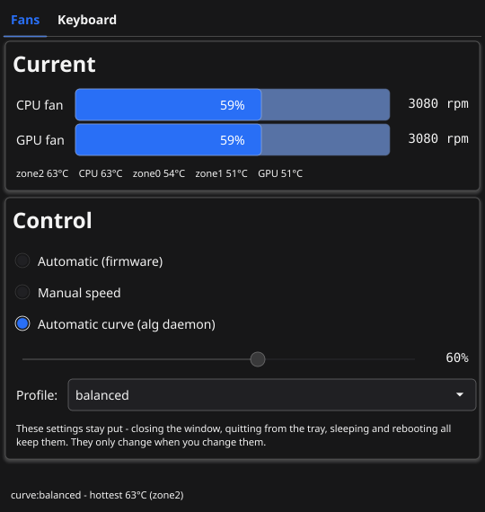
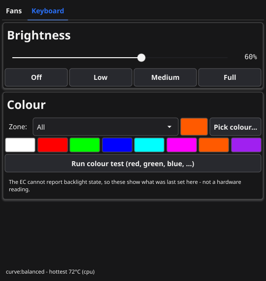

# ALG Control

Fan and keyboard-light control for the **Acer ALG AL15G-53** laptop on Linux.

<p>
  
  
</p>

Acer's own tools only exist for Windows, and the usual Linux tools don't
recognise this laptop. This app fills the gap.

> **Only for this laptop.** ALG Control talks directly to the chip that runs
> the fans and keyboard lights in the Acer ALG AL15G-53. Do not install it on
> any other model: on different hardware the same commands could do anything.

Tested on **Linux Mint 22.3 (Cinnamon)**. It has not been tried on other
systems.

## What you get

- **Fan control.** Let the laptop decide, pick a fixed speed, or have the fans
  follow the temperature using a silent, balanced or performance setting.
- **Keyboard lights.** Brightness and colour, for the whole keyboard or for
  the left, middle and right parts separately.
- **The temperature in your panel**, next to the clock, with quick fan
  settings one click away.
- **It remembers.** Your settings come back after a restart and after sleep.
- **No passwords.** You type your password once, to install. Never again.

## Install

1. Download **`alg-control_1.1_amd64.deb`** from the [Releases page](https://github.com/sarthakrpc/acer-alg-linux-controls/releases/latest).
2. Double-click it and press **Install Package**.
3. Type your password when asked.

That's it. **ALG Control** is now in your applications menu, and the
temperature appears in the panel straight away. From now on it starts by
itself whenever you log in.

If you had the older version of this tool, the installer removes it for you
and keeps your settings.

Don't have the installer file? See [Build the installer yourself](#build-the-installer-yourself).

## Using it

### The window

Open **ALG Control** from the applications menu.

**Fans** shows how fast each fan is spinning and how hot things are. Below
that you choose how the fans behave:

| Mode | What it means |
|---|---|
| **Automatic (firmware)** | The laptop decides, exactly as if this app weren't installed. |
| **Manual speed** | You pick a speed with the slider, and it stays there until you change it. |
| **Automatic curve** | The fans speed up as the laptop gets hotter. Pick a profile: `silent`, `balanced`, `performance` or `max`. |

The profile list also has `quiet` and `mine`. Those are two examples from the
settings file, `/etc/alg.conf`, which you can edit or copy to make your own.

**Keyboard** has a brightness slider, a colour picker, eight ready-made
colours, and a choice of which part of the keyboard to colour.

Closing the window doesn't change anything. Your settings stay exactly as you
left them.

### The icon in the panel


The number is the hottest temperature inside the laptop, in °C. It is white
when things are cool, amber from 70 °C, and red from 85 °C.

- **Click it** to open the window.
- **Right-click it** for quick choices: open the window, or put the fans on
  automatic, on the curve, or at 50%, 75% or 100%.

Choosing *Quit* there only removes the icon. Your settings stay, and the icon
returns the next time you log in or open ALG Control.

### In a terminal, if you prefer

```bash
alg status                 # fans, temperatures and keyboard at a glance
alg fan set 70             # both fans at 70%
alg fan curve balanced     # follow the temperature
alg fan auto               # let the laptop decide
alg kbd color orange       # a colour name, or #rrggbb
alg kbd brightness 50      # 0 to 100
```

Type `alg` on its own to see everything it can do. None of it needs `sudo`.

## Is it safe?

- **Your laptop still protects itself.** Its built-in overheating protection
  works no matter what this app is doing. No software can switch it off.
- **On a curve, heat wins.** If anything reaches 95 °C the fans go straight to
  full speed, and stay there until it has cooled down.
- **Manual means manual.** A fixed speed stays fixed even when the laptop gets
  hot, so don't leave the fans low during heavy work. Below about 20% they may
  stop turning altogether.
- **If the app ever stops** while following a curve, the fans go back to the
  laptop's own control.
- **Uninstalling** hands the fans back to the laptop first.

## If something isn't right

**The temperature icon is missing.** Open ALG Control from the menu once; that
brings it back. If it never appears at login, open Mint's *Startup
Applications* and make sure *ALG Control (tray icon)* is switched on.

**The window says the service is not running.** Start it again:

```bash
sudo systemctl restart alg
```

If it still won't start, this shows why:

```bash
journalctl -u alg -n 30
```

**It says "not authorised".** That happens on accounts that aren't
administrators. Allow the account, putting its username in place of `NAME`:

```bash
sudo adduser NAME alg
```

**The keyboard colour on screen doesn't match the keyboard.** The keyboard
can't report its colour back, so the window shows what was last set here. A
change made in Windows won't show up. The laptop's own keyboard-light key does
nothing under Linux, which is a limit of the laptop rather than of this app.

## Uninstall

```bash
sudo apt remove alg-control
```

The fans go back to automatic. Your keyboard settings and any fan profiles you
wrote are kept in case you reinstall; to remove those as well, use
`sudo apt purge alg-control` instead.

## Build the installer yourself

You need Go 1.24 or newer, plus a C compiler and a few graphics headers:

```bash
sudo apt install gcc libgl1-mesa-dev xorg-dev
```

Then, in this folder:

```bash
make deb
```

The first build takes a couple of minutes. The installer appears at
`build/alg-control_1.1_amd64.deb`. Keep a copy of it somewhere safe: it
contains everything, so you can reinstall later without this folder.

## More detail

- [docs/TECHNICAL.md](docs/TECHNICAL.md) explains how it works inside, how to
  write your own fan curves, the full safety design, and how to develop it
  without the hardware.
- [recon/NOTES.md](recon/NOTES.md) records how the laptop's fan and keyboard
  commands were worked out.
